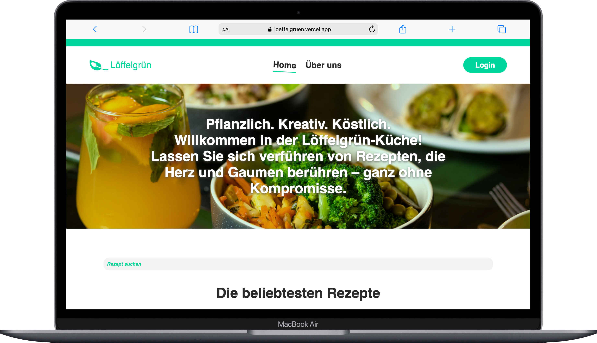
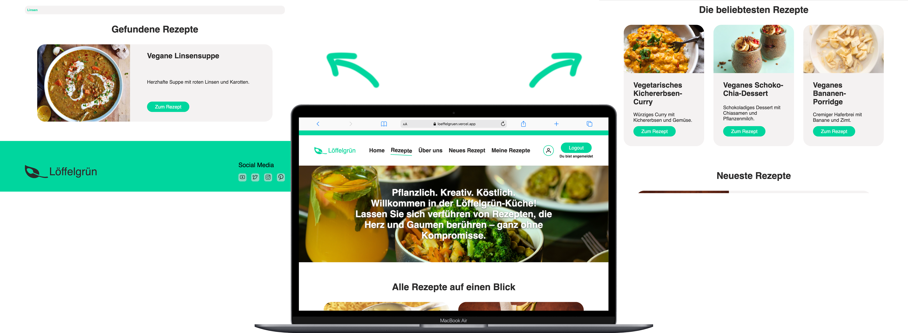

# 🥄 Löffelgrün – A Recipe Platform

<div align="center">
  
</div>

**Löffelgrün** is a recipe web app developed during my Web Development Bootcamp. Built using **React**, **Vite**, and **Supabase**, it allows users to explore and manage recipes with a sleek, responsive UI. This project is part of my learning journey and reflects my growing skills in modern web development.

---

## Table of Contents 📑

- [About](#about)
- [Tech Stack](#tech-stack)
- [Getting Started](#getting-started)
  - [Prequisites](#prequisites)
  - [Installation](#installation)
- [Design](#design)
- [Deployment](#deployment)
- [Work in Progress 🚧](#work-in-progress-🚧)

---

## About

**Löffelgrün** is a culinary web application where users can browse and contribute recipes. It combines a clean and user-friendly frontend built in **React** with a backend powered by **Supabase** for real-time data storage and authentication.

### Key Features:

- View a collection of recipes  
- Add, save and delete your own recipes  
- Search for recipes  
- Add recipes to your favourites  

This app was created as a solo project within a limited timeframe to practice **React**, **CSS styling**, and **backend integration with Supabase**.

<div align="center">
  
</div>


---

## Tech Stack

**Frontend:**  
  


**Backend / BaaS:**  


**Markup & Styling:**  
  


**Development Tools:**  
  
  


---

## Getting Started

Follow these steps to set up the project locally.

### Prequisites

Make sure you have the following installed:

- [Node.js](https://nodejs.org/)
- [Git](https://git-scm.com/)
- [VS Code](https://code.visualstudio.com/)
- [Supabase account](https://supabase.com/)

### Installation

1. **Clone the repository**  
   ```bash
   git clone https://github.com/MonaEis/recipes.git
   cd recipes

    Install dependencies

npm install

Configure Supabase
Create a .env file and add your Supabase credentials:

VITE_SUPABASE_URL=https://your-project.supabase.co
VITE_SUPABASE_ANON_KEY=your-anon-key

Start the development server

    npm run dev

Your app will be running at:
👉 http://localhost:5173


## Design

The design and name of **Löffelgrün** were fully created by me.  
My goal was to craft a clean, modern, and user-friendly recipe platform with a fresh identity.

All styling and layout were built using **custom CSS only** – no component libraries were used. This allowed me to deepen my understanding of fundamental styling and maintain full creative control over the visual appearance.

⚠️ The app is **still a work in progress** – responsive layout for all screen sizes is currently being implemented.

<!-- ### Responsive Example Screenshots:

<div align="center">
  
  
</div> -->


## Deployment

The app is deployed via Vercel.
Here’s the live version of Löffelgrün:

🔗 [Live App](https://loeffelgruen.vercel.app/)


## Work in Progress 🚧

The following features are currently planned or in development:

    ✅ Responsive design for all screen sizes

    🧩 Filter recipes by type or category

    ✏️ Edit own recipes after creation

Stay tuned – updates coming soon!