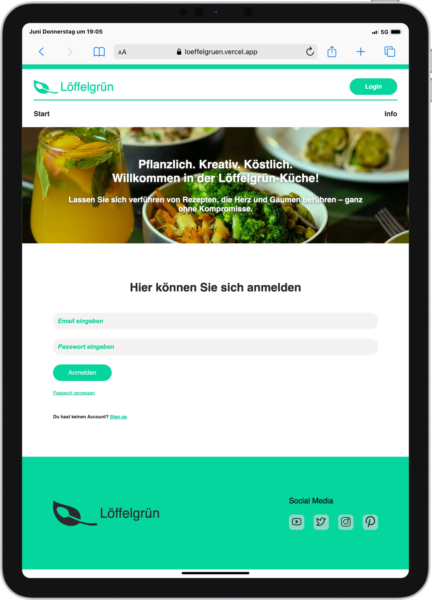
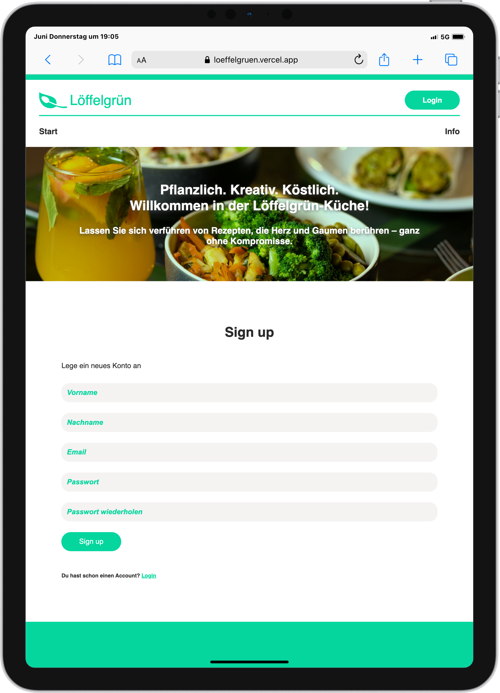
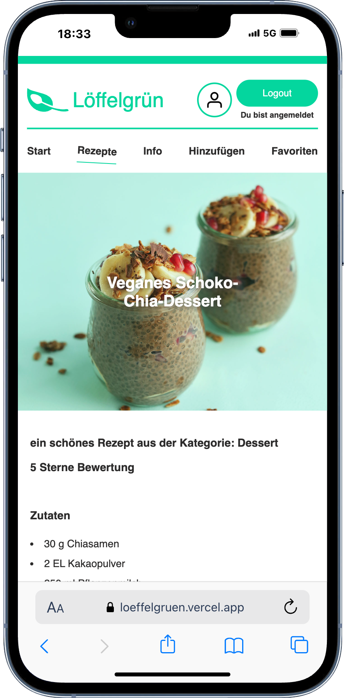
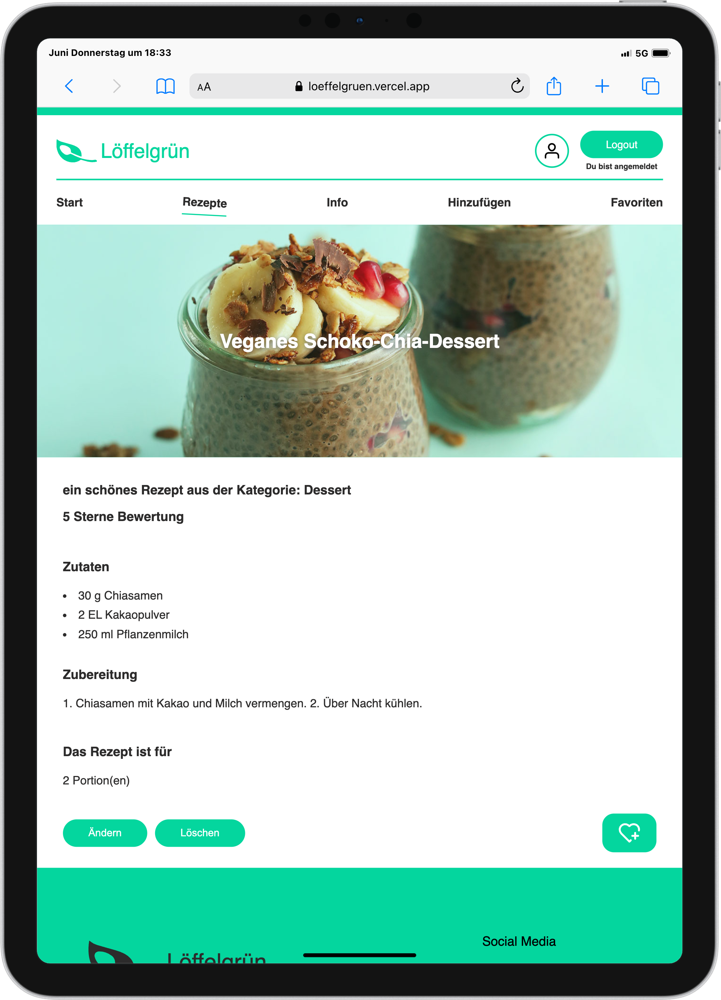

# 🥄 Löffelgrün – A Recipe Platform

<div align="center">
  
</div>

**Löffelgrün** is a recipe web app developed during my Web Development Bootcamp. Built using **React**, **Vite**, and **Supabase**, it allows users to explore and manage recipes with a sleek, responsive UI. This project is part of my learning journey and reflects my growing skills in modern web development.

---

## Table of Contents 📑

- [About](#about)
- [Authentication](#authentication)
- [Tech Stack](#tech-stack)
- [Getting Started](#getting-started)
  - [Prequisites](#prequisites)
  - [Installation](#installation)
- [Design](#design)
- [Deployment](#deployment)
- [Work in Progress 🚧](#work-in-progress-🚧)

---

## About

**Löffelgrün** is a culinary web app where users can browse, create, and manage recipes. The frontend is built with **React** and styled with **custom CSS**, while **Supabase** handles the backend, authentication, and real-time database features.


### ✨ Key Features:

- 📖 Browse a collection of recipes  
- ➕ Add, edit, and delete your own recipes  
- 🔍 Search recipes by title  
- ⭐ Save recipes to your favourites  
- 📱 Responsive UI for all screen sizes 


This app was created as a solo project to deepen my knowledge in **React**, **state management** and **backend-as-a-service** platforms like Supabase.

<div align="center">
  
</div>


---
## Authentication:

User authentication is handled via Supabase Auth. Users can sign up and log in using their email and password.

Once authenticated, users can:

- Browse and view all available recipes

- Add their own recipes

- Add a picture to their profile 

- Edit and delete their own recipes

- Save recipes to their favourites

Supabase handles session management and provides secure access via JWT tokens in the background. All interactions with the backend are scoped to the authenticated user.
⚠️ Auth state is preserved across sessions using Supabase’s built-in client library.

<div align="center">
  
  
   
</div>

---

## Tech Stack

**Frontend:**  
  


**Backend / BaaS:**  


**Styling:**  
  


**Dev Tools:**  
  
  


---

## Getting Started

Follow these steps to set up the project locally.

### Prequisites

Make sure you have the following installed:

- [Node.js](https://nodejs.org/)
- [Git](https://git-scm.com/)
- [VS Code](https://code.visualstudio.com/)
- [Supabase account](https://supabase.com/)

### Installation

1. **Clone the repository**  
   ```bash
   git clone https://github.com/MonaEis/recipes.git
   cd recipes

    Install dependencies

npm install

Configure Supabase
Create a .env file and add your Supabase credentials:

VITE_SUPABASE_URL=https://your-project.supabase.co
VITE_SUPABASE_ANON_KEY=your-anon-key

Start the development server

    npm run dev

Your app will be running at:
👉 http://localhost:5173


## Design

The design and branding of **Löffelgrün** were fully developed by me.
My goal was a clean, modern, and user-first experience — with a unique visual identity that feels fresh and approachable.

All layouts were built using **vanilla CSS**, without any UI libraries, to keep full control and build styling skills from the ground up.

### Responsive Example Screenshots:

<div align="center">
  
  
  
</div>


## Deployment

The app is deployed via Vercel.
Here’s the live version of Löffelgrün:

🔗 [Live App](https://loeffelgruen.vercel.app/)


## Work in Progress 🚧

The following features are currently planned or in progress:

- 🧩 Filter recipes by category

- 💬 Add comments or notes to recipes *(optional future feature)*

- 👥 User profile page with recipe history *(optional future feature)*

Stay tuned – updates coming soon!


## Easter Egg 
Maybe you shouldn't click to often on your profile picture if you don't like some music 😅